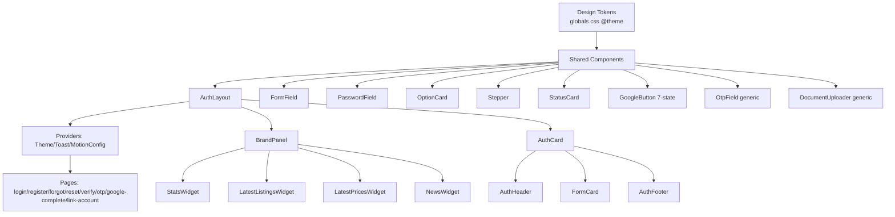
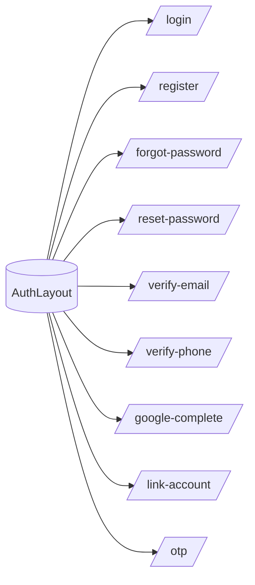

# AUTH_ARCHITECTURE.md — Auth System Architecture

> Scope: the auth area of the marketplace (frontend UI system + role-based registration support).
> Decisions: see `../adr/ADR-013-auth-system.md` (and `../adr/ADR-012-auth-providers.md` for the provider model).
> State machines & sequences: `AUTH_STATE_MACHINE.md`. API contracts: `AUTH_API.md`.

## 1. Goals

- One design system across all auth pages (login, register, forgot/reset password, verify email/phone, google-complete, link-account, otp).
- Professional, consistent UI: RHF + Zod validation, shadcn/ui primitives, shared components, no duplicated CSS.
- Role-based registration that creates **consistent backend state** (user + business profile with `status='pending'`).
- Business registration: **method before form** (Google or email); Google users never re-fill identity fields.
- Resilience: user creation is decoupled from business-profile creation (`profileStatus` enum); live brand panel degrades per-widget.

## 2. Folder Structure

```
nextjs-frontend/src/
├── app/(auth)/
│   ├── layout.tsx                    ← AuthLayout (providers + BrandPanel + AuthCard shell)
│   ├── login/page.tsx
│   ├── register/page.tsx             ← wizard (role → method/form → OTP)
│   ├── forgot-password/page.tsx
│   ├── reset-password/page.tsx
│   ├── verify-email/page.tsx
│   ├── verify-phone/page.tsx
│   ├── google-complete/page.tsx      ← session/verify/error modes
│   ├── link-account/page.tsx         ← google link_required mode
│   └── otp/page.tsx                  ← shared OTP page (email/phone verification)
├── components/auth/
│   ├── AuthLayout.tsx                (or lives in layout.tsx)
│   ├── BrandPanel.tsx                ← live widgets container (desktop)
│   ├── widgets/
│   │   ├── StatsWidget.tsx           (cache 60s)
│   │   ├── LatestListingsWidget.tsx  (cache 30s)
│   │   ├── LatestPricesWidget.tsx    (cache 60s)
│   │   └── NewsWidget.tsx            (cache 5min)
│   ├── AuthCard.tsx / AuthHeader.tsx / AuthFooter.tsx
│   ├── GoogleButton.tsx              (7-state)
│   ├── OtpField.tsx                  (generic)
│   └── DocumentUploader.tsx          (generic, reusable for listings)
├── components/form/
│   ├── FormField.tsx / PasswordField.tsx / OptionCard.tsx / Stepper.tsx / StatusCard.tsx
└── hooks/auth/
    ├── useBrandStats.ts / useLatestListings.ts / useLatestPrices.ts / useLatestNews.ts
    └── useBusinessProfile.ts         (POST /auth/business-profile)
```

Backend additions (see `AUTH_API.md`): migration `053_business_roles.sql`, extended `register-with-otp`, `POST /auth/business-profile`, `google/authorize?role`, redesigned `GET /stats/public`, `link_required` → `/link-account`.

## 3. Component Tree



## 4. Route Tree



| Route | Purpose | States |
|---|---|---|
| `/login` | email+password, Google, EMAIL_NOT_VERIFIED OTP | form, otp (internal) |
| `/register` | wizard: role → method/form → OTP | role, method, form, otp |
| `/forgot-password` | email → reset link sent | form, sent |
| `/reset-password` | token validation, new password, `mode=set` | invalid, form, done |
| `/verify-email` | email token verify | loading, success, error |
| `/verify-phone` | phone OTP verify | form, otp |
| `/google-complete` | post-Google callback | session, verify, error |
| `/link-account` | Google link with password | form, success, error |
| `/otp` | shared OTP entry (email/phone) | form, otp |

## 5. Form Flow

1. Zod schema per view (`registerSchema`, `loginSchema`, business `superRefine` per role).
2. RHF `useForm` + `zodResolver`; `defaultValues` per step.
3. Validate on submit; errors under fields (`FormMessage`), `aria-live="polite"`.
4. Submit → hook (`useAuth`/`useBusinessProfile`) → loading state on the single CTA → success (redirect / StatusCard) or error (code → message map in `AUTH_API.md`).
5. `autocomplete`: `name`, `email`, `tel`, `new-password`, `current-password`.

## 6. Error Flow

- Backend error codes are mapped to Farsi messages + recovery actions (table in `AUTH_API.md`).
- Widget errors: «در حال حاضر در دسترس نیست» + [تلاش مجدد] — never a blank panel.
- Business profile failure after session: user stays logged in; UI shows `profileStatus='incomplete'` + dashboard CTA.

## 7. Loading Flow

- Buttons: spinner + disabled during async.
- Widgets: per-widget skeletons (300ms+ threshold).
- GoogleButton: `Loading` (status check) → `Redirecting` (hand-off to Google).
- Cache (staleTime): Stats 60s / Listings 30s / Prices 60s / News 5min.

## 8. Success Flow

- Regular user: redirect to `?redirect=` or `/`.
- Business (email): session issued; if profile failed → StatusCard «incomplete» with dashboard link; else StatusCard «در انتظار تأیید ادمین».
- Business (Google): finalize issues session → business form → POST → StatusCard «در انتظار تأیید ادمین».
- Reset password: StatusCard success → link to login.

## 9. Definition of Done

- [ ] All auth pages use `AuthLayout` (providers + AuthCard).
- [ ] No auth form outside RHF + Zod.
- [ ] No duplicated form CSS (tokens/components only).
- [ ] Email, Google and business flows E2E-tested, including the profile-failure scenario.
- [ ] Accessibility minimums pass: contrast ≥4.5:1 (both themes), keyboard focus, `aria-live` errors, touch targets ≥44px, `prefers-reduced-motion`.
- [ ] All tests green (backend vitest), `tsc` clean in both projects, frontend build passes.

## References

- `../adr/ADR-013-auth-system.md` — decisions & scope
- `../adr/ADR-012-auth-providers.md` — provider/Google/OTP security model
- `AUTH_STATE_MACHINE.md` — Mermaid state & sequence diagrams
- `AUTH_API.md` — endpoint contracts & versioning
- `../auth-redesign-plan.md` — locked implementation plan (v7)
