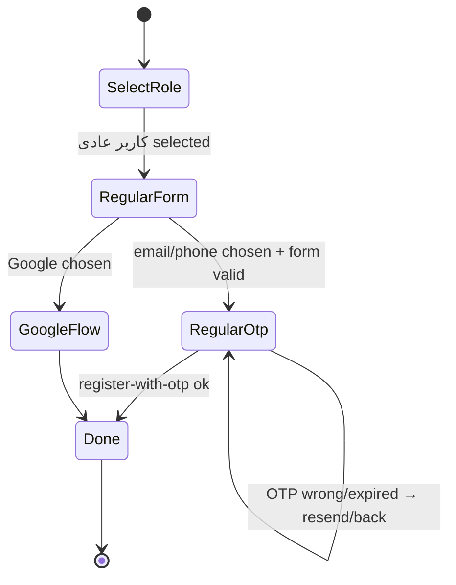
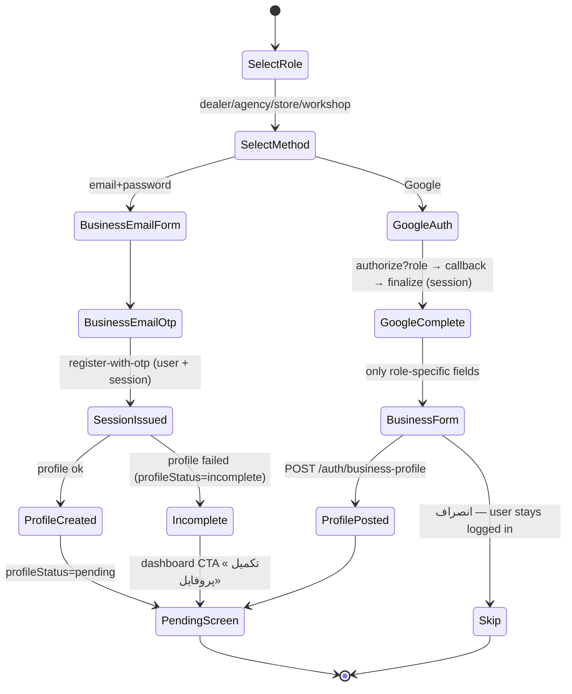
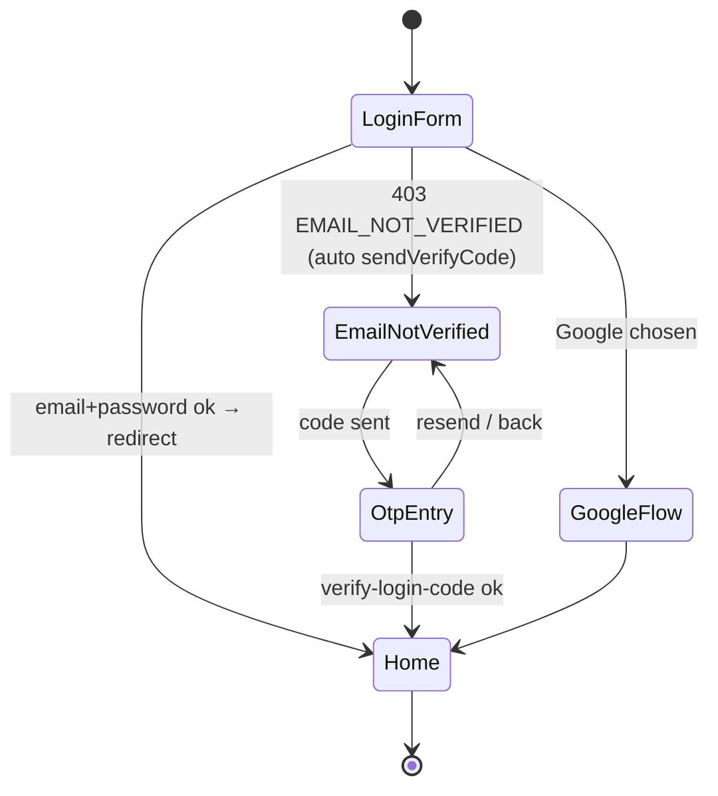
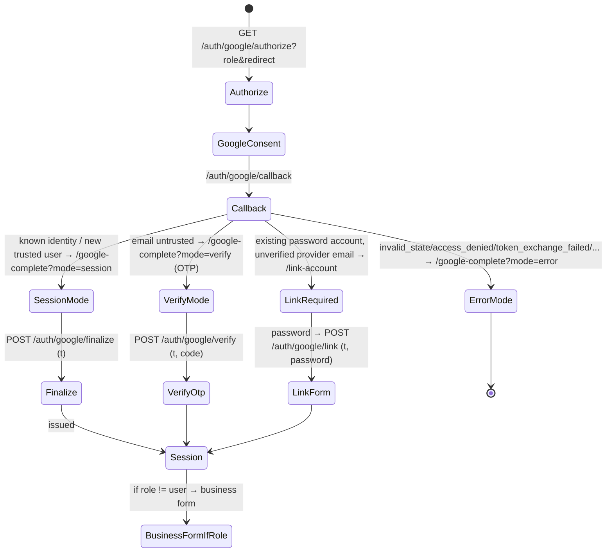
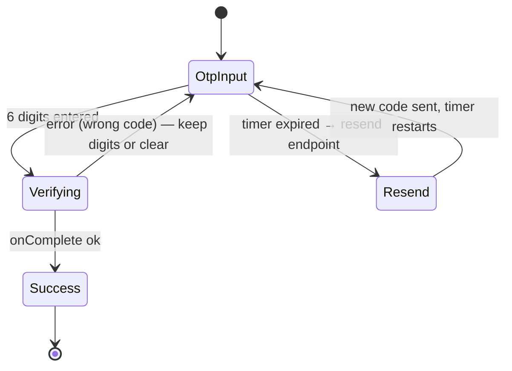
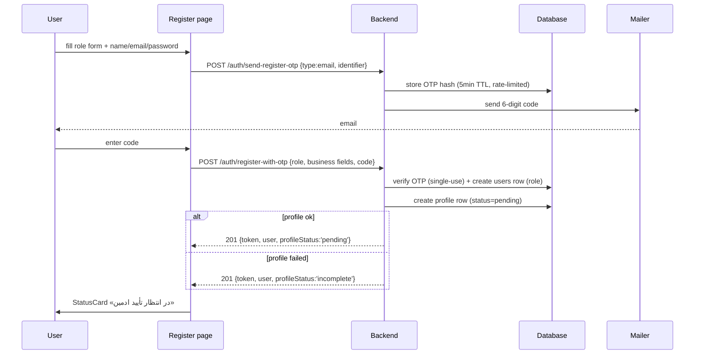
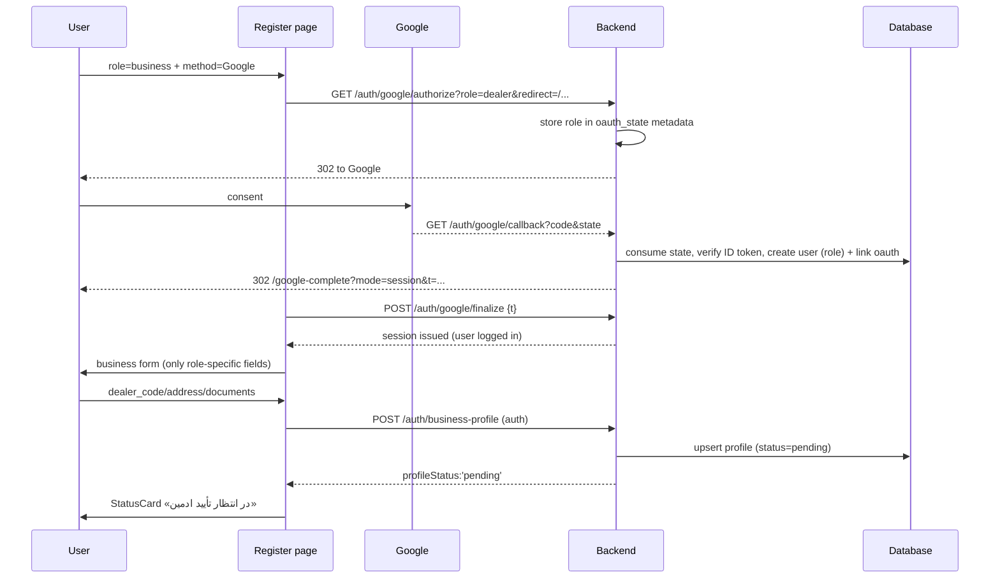
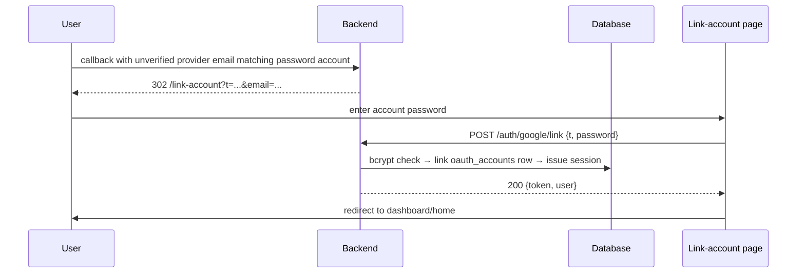
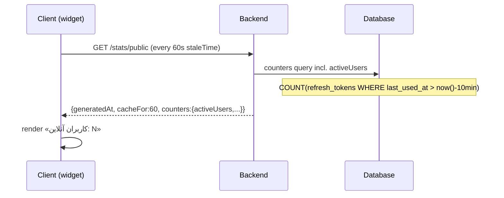

# AUTH_STATE_MACHINE.md — Auth Flow State Machines & Sequences

All diagrams are Mermaid and rendered in most GitHub/VS Code viewers.

## 1. Registration Wizard (Frontend)

### 1.1 Regular user — 2 steps

### 1.2 Business — 3 steps (method before form)

## 2. Login

## 3. Google Flow (backend modes → frontend pages)

## 4. OTP (generic OtpField usage)

## 5. Sequence — Email registration (business)

## 6. Sequence — Google registration with business role

## 7. Sequence — Link account (existing password user signs in with Google)

## 8. Sequence — Active users metric

