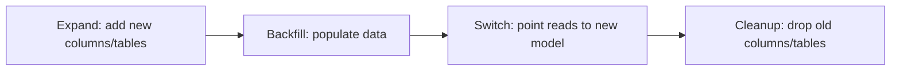

# Versioning & Migration Strategy

## Schema Versioning

Database migrations use ISO 8601 date prefix: `YYYYMMDD_description.sql`
- Must be idempotent (IF NOT EXISTS / IF EXISTS)
- Must have BEGIN/COMMIT wrapping
- Must never modify a released migration

## API Versioning

Header-based: `Accept: application/vnd.marketplace.v1+json`

## Event Versioning

Each event schema carries:
- `event_type_version` — version of the event type definition
- `payload_version` — version of the payload schema  
- `schema_version` — orchestrator/overall schema version

Rules:
- Event schemas are backward compatible (add-only fields)
- Breaking changes create a new event type (e.g. `ListingCreated` → `ListingPublished`)
- Old events are never modified in the database

## Migration Strategy: Expand → Backfill → Switch → Cleanup

### Phase Details
1. **Expand** — Add the new structure alongside existing (ALTER TABLE ADD COLUMN, CREATE TABLE)
2. **Backfill** — Populate new structure from old data (scheduled job)
3. **Switch** — Change read path to new model; old becomes fallback
4. **Cleanup** — Remove old columns/tables (after N days of monitoring)

## Zero Downtime Rules

| Operation | Strategy |
|-----------|----------|
| Add column | Safe (new column nullable or with default) |
| Drop column | Safe only after Switch phase + monitoring period |
| Rename column | Create new → backfill → drop old |
| Add NOT NULL | Only after all rows populated |
| Add FK | Only if all referencing rows exist |
