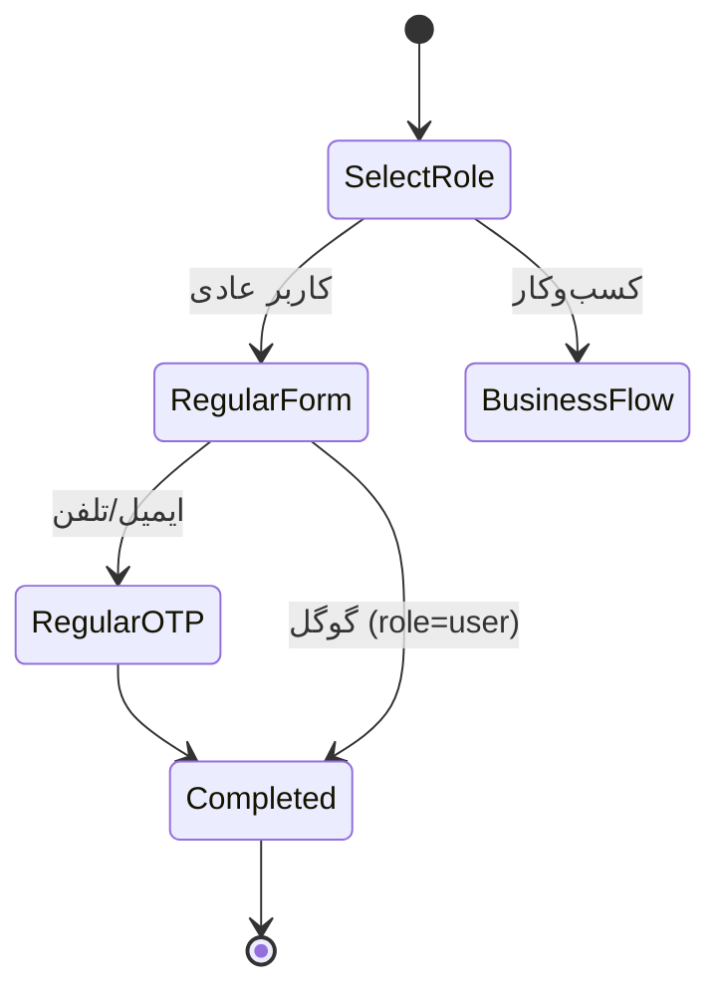

# بازطراحی سیستم احراز هویت (ورود / ثبت‌نام / مدیریت حساب) — نسخه ۷ (LOCKED)

## هدف

بازطراحی کامل UI/UX و معماری فرانت سیستم احراز هویت: صفحات لاگین/ثبت‌نام و تمام مسیرهای مرتبط، با یک لایه طراحی مشترک (`AuthLayout`) و کامپوننت‌های استاندارد (RHF + Zod + shadcn/ui). هم‌زمان قابلیت‌های بک‌اند لازم برای ثبت‌نام نقش‌محور (کسب‌وکارها) تکمیل می‌شود.

> **محدوده (ضد Scope Creep):** این پلن فقط بازطراحی سیستم احراز هویت است (صفحات auth، پروفایل‌های کسب‌وکار، OTP، گوگل، آپلود مدارک). هر قابلیت خارج از این محدوده — Dashboard، Notifications، Chat، Search، MFA، Passkeys، OAuth Providerهای دیگر و … — در ADR/پلن جداگانه بررسی خواهد شد و در این پروژه افزوده نمی‌شود.

## مستندات مرتبط (تولید قبل از کد)

| فایل | محتوا |
|---|---|
| `docs/architecture/AUTH_ARCHITECTURE.md` | نمای کلی معماری + Component Tree + Route Tree + Definition of Done |
| `docs/architecture/AUTH_STATE_MACHINE.md` | State Machine + Sequence Diagram (Mermaid) |
| `docs/architecture/AUTH_API.md` | قراردادهای API + جدول Versioning + Sequence Diagram |
| `docs/adr/ADR-013-auth-system.md` | تصمیم‌های معماری این سیستم (ارجاع از AUTH_ARCHITECTURE) |

## تصمیمات نهایی

| موضوع | تصمیم |
|---|---|
| فرم‌ها | `react-hook-form` + `zod` + `@hookform/resolvers` — هیچ اعتبارسنجی دستی‌ای در فرم‌های auth |
| پریمیتیوها | shadcn/ui (button/input/card/form/label/select/badge/alert) مپ‌شده به توکن‌های موجود سایت؛ فالبک: Radix دستی |
| چیدمان | `AuthLayout` مشترک: `ThemeProvider + ToastProvider + MotionConfig ← Children` — همه صفحات auth از آن |
| پنل برند | **زنده** — ۴ ویجت مستقل (هرکدام Loading/Error/Retry خودش؛ شکست یکی پنل را سفید نمی‌کند) |
| کش ویجت‌ها | Stats 60s / Listings 30s / Prices 60s / News 5min |
| کاربر عادی | **۲ مرحله**: انتخاب نقش ← فرم ثبت‌نام (گوگل + ایمیل/تلفن + رمز) — OTP حالت داخلی همان مرحله |
| کسب‌وکار | **۳ مرحله**: نقش ← روش ورود (ایمیل و رمز / گوگل) ← فرم اختصاصی |
| روش قبل از فرم | گوگل: داده از گوگل می‌آید، فرم فقط فیلدهای اختصاصی کسب‌وکار بعد از finalize |
| sessionStorage | حذف شد (فرم کسب‌وکار بعد از گوگل پر می‌شود — نیازی نیست) |
| جداسازی User/Profile | ساخت کاربر ← صدور سشن ← ساخت پروفایل جدا؛ خطای فرم کسب‌وکار = کاربر وارد شده می‌ماند |
| `profileStatus` | Enum: `complete / incomplete / pending / approved / rejected` — تایپ مشترک بک‌اند و فرانت |
| گوگل | `authorize?role=X` → metadata توکن state → کاربر جدید با نقش انتخابی؛ `link_required` → مسیر `/link-account` |
| پروفایل کسب‌وکار | `POST /auth/business-profile` (auth + rate limit) — بعد از گوگل یا تکمیل از داشبورد |
| OTP | کامپوننت جنریک `OtpField` — بدون وابستگی به register/login؛ قابل استفاده برای verify/forgot/2FA آینده |
| GoogleButton | ۷ حالت: `Idle / Hover / Loading / Redirecting / Success / Error / Disabled` |
| DocumentUploader | جنریک و قابل استفاده مجدد (آگهی‌ها) — Drag&Drop + Preview + Crop(اختیاری) + Progress + Retry + Delete + محدودیت حجم/فرمت؛ فقط تصویر |
| Stepper | فقط در Register (نقش‌محور)؛ در Login وجود ندارد |
| Tab | ممنوع — نقش/روش با OptionCard؛ سوییچ ایمیل/تلفن با چیپ کوچک |
| فونت/رنگ | Vazirmatn (هدینگ 800/900، بدنه 300/400) + پالت کرم/قهوه‌ای موجود — بدون رنگ خارج از توکن‌ها |
| امضای بصری | «پنل ابزار خودرو» + ۸ افکت: Gradient Mesh / Grid / Aurora / Glass Reflection / Animated Border / Floating Cards / Noise / RoadDash |

## معماری کامپوننت (لایه‌بندی)

```
Design Tokens (globals.css: --shadow-card, --shadow-popover, --ease-out-cubic, durations)
   ↓
Shared Components (components/auth|form):
   FormField · PasswordField · Button · OptionCard · Stepper · StatusCard
   OtpField (جنریک) · GoogleButton (۷ حالت) · DocumentUploader (جنریک)
   ↓
AuthLayout (layout.tsx گروه (auth)):
   Providers (Theme/Toast/Motion) ← BrandPanel (۴ ویجت زنده) ← AuthCard
   AuthCard = AuthHeader + FormCard + AuthFooter
   ↓
Pages: /login /register /forgot-password /reset-password /verify-email /verify-phone
       /google-complete /link-account /otp
```

## فلوی ثبت‌نام

### کاربر عادی — ۲ مرحله



### کسب‌وکار — ۳ مرحله (روش قبل از فرم)

```mermaid
stateDiagram-v2
    [*] --> SelectRole
    SelectRole --> SelectMethod: نمایندگی/نمایشگاه/فروشگاه/تعمیرکار
    SelectMethod --> EmailForm: ایمیل و رمز
    SelectMethod --> GoogleAuth: گوگل
    EmailForm --> EmailOTP
    EmailOTP --> UserCreated
    GoogleAuth --> GoogleComplete: callback + finalize (سشن صادر)
    GoogleComplete --> BusinessForm: فقط فیلدهای اختصاصی نقش
    BusinessForm --> BusinessPosted: POST /auth/business-profile
    UserCreated --> BusinessPosted
    BusinessPosted --> PendingScreen: profileStatus=pending
    Note over BusinessForm: انصراف = کاربر وارد است؛ تکمیل بعدی از داشبورد
    PendingScreen --> [*]
```

## بک‌اند (فاز صفر)

| # | تغییر | نکته |
|---|---|---|
| ۱ | مایگریشن `053_business_roles.sql` | `dealer_profiles.status` (DEFAULT 'approved' برای قدیمی‌ها) + `refresh_tokens.{last_used_at,last_ip,last_user_agent}` |
| ۲ | `GET /stats/public` | فیکس کوئری (`dealers` ← `dealer_profiles`) + پاسخ `{generatedAt, cacheFor, counters, latest}` — آینده‌نگر |
| ۳ | `activeUsers` | `COUNT(refresh_tokens WHERE last_used_at > now()-10min)` — در UI با برچسب «کاربران آنلاین» |
| ۴ | اسکیماها | فیلدهای کسب‌وکار در `registerWithOtpSchema` + `superRefine` نقش + `businessProfileSchema` + پارامتر `role` در authorize + enum `ProfileStatus` |
| ۵ | `AuthService.registerWithOtp` | کاربر ← سشن (حتی اگر پروفایل خطا خورد: `profileStatus:'incomplete'`) ← پروفایل |
| ۶ | `POST /auth/business-profile` | auth + rate limit؛ ساخت پروفایل pending (dealer/agency → dealer_profiles با dealer_code؛ store → store_profiles؛ workshop → workshop_profiles) |
| ۷ | رفع `dealer_code` | `services/dealer.ts` upgrade — نوشتن مقدار دریافتی + status |
| ۸ | `flowRedirect` | mode=link_required → `${frontendUrl}/link-account` |

## طراحی صفحه ورود

- ستون برندینگ: پنل قهوه‌ای تیره (`bg-foreground`) + گرید پیکسل + هاله کهربایی + آمار tabular + موتیف جاده؛ موبایل: مخفی
- کارت `glass-strong rounded-3xl` + `--shadow-card`؛ RHF+zod؛ autocomplete درست؛ خطا زیر فیلد + `aria-live`؛ PasswordField با چشم
- حالت OTP (EMAIL_NOT_VERIFIED): sub-state داخلی + `OtpField` + resend؛ بدون Stepper
- CTA واحد با اسپینر؛ حفظ `?redirect=`؛ لینک‌های forgot/register

## Design Tokens (globals.css)

- سایه‌ها: `--shadow-card`, `--shadow-popover` (رتبه‌بندی‌شده)
- موشن: `--ease-out-cubic`, `--duration-150/250/400`
- بدون hex پراکنده در کامپوننت‌ها — فقط توکن‌های معنایی

## DocumentUploader (جنریک)

Drag&Drop + Preview + Crop (خاموش پیش‌فرض) + Progress bar + Retry + Delete + محدودیت حجم (۵MB) و فرمت (تصویر) + فلوی presigned موجود (`POST /upload/presigned` → PUT)؛ خروجی `documents: string[]`؛ معماری مستقل برای استفاده در آگهی‌ها.

## Definition of Done

- [ ] همه صفحات Auth از `AuthLayout` استفاده می‌کنند
- [ ] هیچ فرم Auth خارج از RHF + Zod نیست
- [ ] هیچ CSS تکراری برای فرم‌ها وجود ندارد (کلاس‌ها فقط در توکن‌ها/کامپوننت‌ها)
- [ ] هر سه فلوی ایمیل، گوگل و کسب‌وکار E2E تست شده‌اند (شامل سناریوی profile-failure)
- [ ] Accessibility حداقل‌ها پاس شده: کنتراست 4.5:1 (هر دو تم)، فوکوس کیبورد، `aria-live`، تاچ ≥44px، reduced-motion
- [ ] تمام تست‌ها سبز (vitest بک‌اند) + tsc هر دو پروژه تمیز + Build فرانت بدون خطا

## ترتیب اجرا (ثابت)

```
1. docs/architecture/ (ADR-013 + AUTH_ARCHITECTURE + AUTH_STATE_MACHINE + AUTH_API — Mermaid)
2. Backend فاز صفر (مایگریشن ۰۵۳ + stats + اسکیماها + business-profile + فیکس‌ها + vitest)
3. Design Tokens
4. Shared Components (FormField/PasswordField/Button/OptionCard/Stepper/StatusCard/GoogleButton/DocumentUploader)
5. Auth Layout (Providers + BrandPanel با ۴ ویجت مستقل)
6. OtpField (جنریک)
7. Login / Forgot / Reset
8. Register (عادی ۲ مرحله / کسب‌وکار ۳ مرحله)
9. Google Flow (authorize با role + finalize + Link Account)
10. Business Profile (فرم تکمیلی + profileStatus enum)
11. DocumentUploader حرفه‌ای
12. QA + E2E + DoD چک
```

## API Versioning (قرارداد)

- `stats/public` — افزودن `generatedAt/cacheFor/activeUsers` = **Backward Compatible** (هیچ حذفی)
- `register-with-otp` — افزودن فیلدهای اختیاری = **Backward Compatible**
- `google/authorize?role=` — پارامتر جدید اختیاری = **Backward Compatible**
- `POST /auth/business-profile` — اندپوینت جدید = بدون تغییر موجود
- قانون: تا وقتی تغییری از نوع «حذف/تغییر معنا» نباشد v1 می‌ماند؛ در غیر این صورت نسخه جدید (جزئیات در `AUTH_API.md`)
